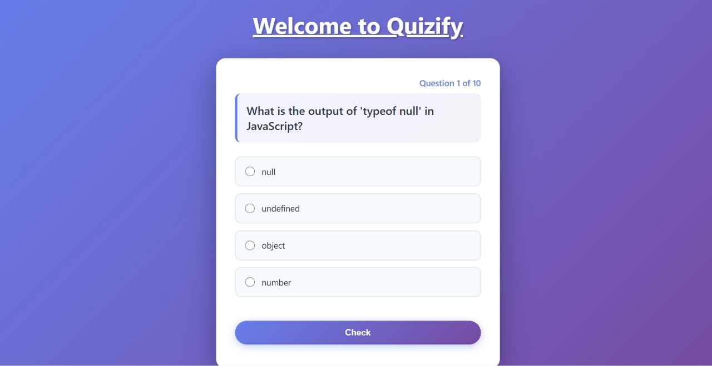

# Quizify - JavaScript Quiz App

An interactive and responsive quiz application built with **HTML, CSS, and JavaScript**.  
It allows users to answer multiple-choice questions, check answers, and track their score dynamically.

## 🚀 Live Demo
**[Click here to try the quiz!](https://quizify-navy.vercel.app/)**

## ✨ Features
- Multiple-choice quiz with JavaScript questions  
- Score tracking with final percentage  
- Instant answer validation (Correct / Wrong feedback)  
- “Next” button for smooth navigation between questions  
- Beautiful card-based UI with responsive design  
- Clean animations and modern styling  

## 🛠️ Technologies Used
- **HTML5** → Structure of the quiz  
- **CSS3** → Styling, layout, and responsive design  
- **JavaScript ** → Core quiz logic, DOM manipulation, and scoring  

## 📸 Screenshot

---

Made with ❤️ by [Vishakha]

